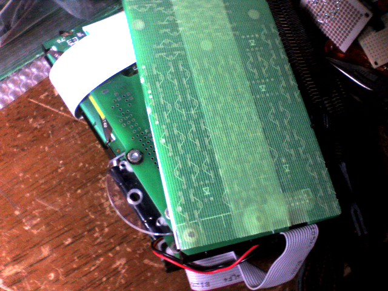
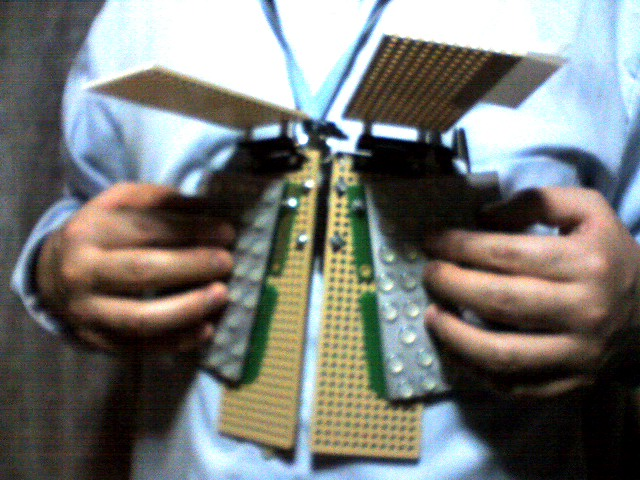
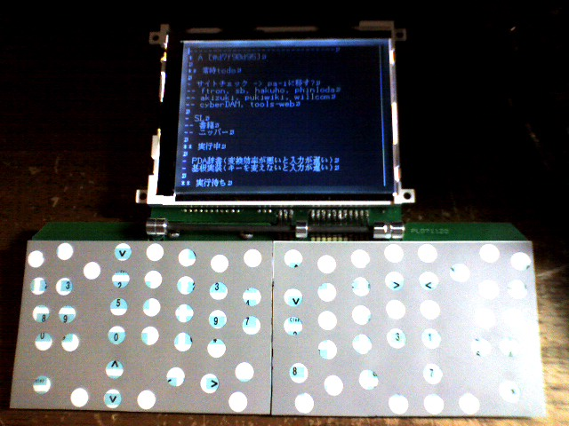

# 片手PDAモックアップ(動画) (2014/04/30)

片手キーボードを搭載したPDAのモックアップを作ってみました。

左腕に装着し、右手で操作する片手PDAのモックアップです。
https://www.youtube.com/watch?v=59HC5Vgg5Ug

# 片手キーボード(動画) (2014/01/28)

机がないところでも使える、片手キーボードを試作してみました。

次世代の自作PDAは、左腕に装着し、右手で操作する形を考えています。このためのキーボードの試作です。
https://www.youtube.com/watch?v=ZqkWG5i-khk

# NetWalker情報 (2011/11/23)

NetWalker関連情報をまとめました。
	[NetWalker] からご覧ください。

# 無線のデモ(動画) (2011/08/28)

先日の展示会でおこなった、無線のデモです。

自作PDAの操作で、無線を使ってLED照明をコントロールしています。
https://www.youtube.com/watch?v=_I9a_yfRfH4

# 無線の実験 (2011/08/05)

自作PDAで、無線通信をする実験をおこなっています。

写真は、先日の展示会で使用した、デモ用のものです。市販の無線モジュールがついており、自作PDAの操作で外部の機器にコマンドを送ることができます。

自作PDAをいろいろなもののコントローラにするというプロジェクトもやっています。なかなか時間が割けていませんが、進捗があればお知らせします。

# 展示会に出展 (2011/07/03)

「テクノトランスファーinかわさき2011」にて、自作PDAのデモをおこないます。

自作PDAがメインではないのですが、簡単なデモができますので、興味のある方はぜひお声がけください。
- 日付: 2011/7/6(水) - 2011/7/8(金)
- 時間: 10:00 - 17:00
- 場所: かながわサイエンスパーク(KSP)
- 最寄り駅: 溝の口駅・武蔵溝ノ口駅
- ホームページ:  http://www.tech-kawasaki.jp/ttk2011/ 

# デュアルスクリーンの使い方 (2011/05/20)

デュアルスクリーンを搭載してしばらく経つのですが、なかなか使い途がありません。

シングルスクリーンで使っていたときは、ずいぶんデュアルスクリーンにあこがれたのですが、いざサポートしてみると、思ったほど使っていません。

今はNetWalkerで動かしているので、他のアプリを見ながら操作できるのが大きいのかも知れません。課題ということで、いろいろ考えてみます。

# メール支援 (2011/04/18)

メールの返信というのは、なかなか手間がかかります。そこで、自作PDAでメールを書きやすくできないか、試しています。

最近ソフトウェアばかりで、なかなか写真つきの報告ができないのですが、今はメール作成を支援する機能を評価しています。

自作PDAでは、プロジェクトごとに日記(日誌)を保存する機能があります。そこで、日誌に特別な方法で文章を書いておくと、あとでその部分を本文にしたメールを、簡単に作成できるようにしました。

また、プロジェクトのページに予定を書き込むと、その予定の確認メールを自動で生成する機能もよういしました。

今はまだ試している段階ですか、人間の方の習慣を変えるのに苦労しているというのが、正直なところです。

# 無事です (2011/03/23)

地震がありましたが、筆者は無事です。

自作PDAも、位置エネルギーが低下しましたが、無事でした。なかなか更新できませんが、今後ともよろしくお願いします。

# X版デュアルスクリーン対応 (2011/02/28)

最近、NetWalker上の自作PDAソフトを使うことが多くなったので、こちらをデュアルスクリーンにしてみました。

もともと、自作PDAでの1つの目標がデュアルスクリーンでしたが、立ったまま使う自作PDAでは、あまり有効に利用できていませんでした。そこで、机で使うことの多いNetWalkerの方に、デュアルスクリーン対応をおこなうことにしました。

デュアルスクリーンとは言っても、もともと自作PDAは320×240の解像度ですので、これを640×240のウィンドウに表示するだけです。ひとまず、これでデュアルスクリーンを評価してみようと思っています。

# 展示会に出展しました (2011/02/11)

横浜で開催されたテクニカルショウヨコハマ2011に出展しました。

2011/2/2(水)〜4(金)の3日間、パシフィコ横浜で自作PDAなどを展示しました。

多くの方に足を運んでいただきました。ありがとうございました。

# 再変換対応 (2011/01/21)

いわゆるテープ起こしをするときに、漢字に変換すると間に合わなくなるので、再変換機能を追加しました。

セミナーなどの原稿を書くのに自作PDAを使っています。いったんボイスレコーダーに録音して、再生しながら入力しています。ただ、スピードを遅くても入力が間に合わないので、最初は平仮名のまま入力し、あとから漢字に変換できるようにしました。

具体的には、平仮名で入力されているところにカーソルを置いて再変換操作をすると、そこから前の平仮名が取りこまれて変換されるようにしました。

本当は、もっといろいろな機能を用意したいのですが、現状でも「ないよりマシ」なので、これで評価しようと思っています。

# デスクトップ対応 (2010/12/25)

ちらかった机の上でも使えるよう、三脚用の穴をつけてみました。

このままでは、さすがに入力が大変なので、キーボードを別にする方向で考えています。

# X-window版 (2010/12/02)
	[メールを自作PDAで書く] というのが、どうもうまく実行できないので、メールに使っているNetWalkerでPDAのデータにアクセスできるようにしてみました。

私の場合は普通、プラットフォーム依存しないようにGUIアプリを書く場合には、xulアプリケーションが第1の選択肢になります。しかし今回のケースでは、自作PDAのコードはCで書かれています。できれば、少なくともコアのコードは共通化したいところです。

データモデルのコンセプト確認にはphpを使用しましたが、これはwebのユーザーインターフェースです。今回は自作PDAの画面をそのまま持ってきたいと考えました。自作PDAはC言語で書かれていますから、NetWalkerでCで書いたGUIアプリケーションを動作させるとなると、X-windowを使うのがベストと判断しました。すでに液晶表示のためにビットマップレベルまでレンダリングされていること、かな漢字変換などを自分で持っていることなども判断の根拠になっています。
	

NetWalkerはOSにLinuxを採用しています。もちろんgccなどもはじめから用意されているので、セルフで開発は可能です。ただ最初は、普段開発に使用しているW2Kマシンで動作させたかったので、Windows上ではcygwinを使うことにしました。

修正箇所はいくつかありますが、大きいのはイベント管理でタスクを使わないようにしたことなどです。

また、ファイルアクセスもLinuxのAPIを使うようにしました。これにより、前回作った同期機能もそのまま利用できる形になりました。

# 同期機能 (2010/11/24)

ネックストラップPDAを作ったので、2台のPDAで相互に編集できるよう、同期機能を用意しました。

とりあえず運用できればいいということで、前回の同期以降に更新された分をファイルに書き出し、ファイルの追記分を取り込んでローカルに反映するようにしました。

前回同期以降に何かを入力するとチェンジバーが表示されるようにしました。また、更新が衝突した場合には、その箇所に別のマークを表示するようにしました。

# ネックストラップPDA試作 (2010/11/11)

首にかけて使用するPDAを試作しました。動画でご覧いただけます。

折りたたみ式のPDAは、机などがないと両手で入力できませんでした。自作ネックストラップPDAは、両手が使えるので、机がなくても立ったままで両手で入力することができます。

画面がよく写っていないのですが、実際に日本語を入力してかな漢字変換をおこなっています。
https://www.youtube.com/watch?v=a9jvlPR2FGQ

念願のデュアルディスプレイにしてみましたが、実際に使ってみると、いくつか課題がでてきました。これでわかったことを元にして改良していく予定です。

# キーボードの作り方 (2010/11/02)

自作PDAのキーボードは、とても簡単に作ることができます。

まず、以下のものを用意します。
- 銀色のフィルムシール
- カッティングシート
- ウレタンのゴム足

フィルムシールは、市販のA4サイズのものです。これにキーの位置をカラーレーザープリンタで印刷します。文字をいれてもいいですし、色をつけることもできます。

カッティングシートは、スイッチの部分をくりぬいたものを用意します。
	

写真の上にあるのが、フィルムシールの裏(糊の面)に、カッティングシートを貼ったものです。TRONキーボードは左右が対称なので、裏返すと同じ形になります。カッティングシートを貼ることで、スイッチに接着するところだけが穴から見え、余計な接着面がカバーされます。両方とも粘着面なので、失敗しないように注意してください。

写真の下は、フィルムシールの表にゴム足を貼りつけているところです。こちらは貼りなおしもできますので、簡単です。

最後に、このフィルムシールをタクトスイッチの上に貼りつけて完成です。

# セキュリティ機能 (2010/10/20)

自作PDAでは、ビデオ出力の映像に、セキュリティ機能があります。

この画面では、日付と、PDAに関する部分は表示されていますが、それ以外には網がかかって見えなくなっています。
	

手元の液晶画面には、すべての情報が表示されています。これは、会議などでプロジェクタに投影しているときに、他社との打ち合わせのような情報を表示しないために用意しました。

# 新LCDテスト成功 (2010/10/06)

次世代PDA用のLCDの動作テストが、やっとうまくいきました。
	[次世代PDA] では、より小型のLCDを使って、デュアルディスプレイにしようとしています。

最初に、PICで簡単な基板を作り、動作確認をします。これは、ドキュメントを読み間違えていたり、そもそもドキュメントに嘘が書いてあったりする場合に、本格的な基板を作ってからだと修正が大変だからです。
	

今回は、いくつか接触不良に悩まされました。3日かかって、やっと動作しました。

# 次世代PDA設計中 (2010/09/28)

アイディア段階の [ネックストラップPDA] を、実際に作ってみようと、いろいろ調べはじめています。

いろいろ変えたい点はあるのですが、ジレンマがあって、一筋縄ではいきません。悩みの中心は、CPUの選択です。さすがにCPUボードを起こすつもりはないので、市販のCPUボードを探すのですが、なかなかいいものが見つかりません。
|CPU|M32R|ARM|
|---|---|---|
|ボードサイズ| 大 | 小 |
|---|||
|メモリ| 8MB | 64KB |
|---|||
|消費電力| 大 | 小 |
|---|||
|移植の手間| なし | 大 |
|---|||
|現行のPDAを残せる| × | ○ |
|---|||
|ビデオ出力| ○ | ? |
|---|||
|バッテリー| 5V | 3.3V |
|---|||

「現行のPDAを残せる」というのは、M32Rのボードの在庫がないため、現行のPDAからCPUボードをはずして流用する、という点です。

本質的な問題は、64KBのメモリで満足できるアプリケーションが動かせるかどうかという点になります。外づけのRAMが載ったARMボードもないわけではないのですが、それなりに手間がかかるという点で、悩んでいます。

# SWEST出展 (2010/09/13)

SWESTという組み込みシステムのワークショップで、自作PDAのデモ出展をおこないました。

今回はワークショップがメインだったので、デモの方には力を割けなかったのですか、いろいろな方とお話させていただきました。

- 筆者のswestのページ:  http://swest.pa-i.org/ 
- SWEST公式ページ:  http://www.ertl.jp/SWEST/ 

# 履歴の管理 (2010/09/02)

自作PDAでは、自動的に入力の履歴を取っています。

履歴を利用して、マークを書き込んだ日時を見たり、文字数がどのように変化しているかを見たりする動画を用意しました。
https://www.youtube.com/watch?v=aYLk_RA80LU

# 次世代PDAモック (2010/08/16)

ネックストラップPDAのモックアップを作成しました。

当初は [ミニ駅弁スタイル] を予定していたのですが、キーボードを体に当てる形に変更してみました。

立ったまま操作してみると、思ったより安定しており、実用になるのではないかという印象でした。

# PDA分解の動画 (2010/07/13)

自作PDAを分解するようすを動画にしました。
-  [全体の配置] 
https://www.youtube.com/watch?v=kHL-9K-biTg

# 動画追加 (2010/06/13)

コンテンツベース学習の動画を用意しました。

以下からご覧いただけます。
-  [かな漢字変換] 
https://www.youtube.com/watch?v=P_zvKje-QX4

# コンテンツベース学習 (2010/06/08)

かな漢字変換で、開いているページの内容そのものを学習辞書として使用するようにしました。

普通、かな漢字変換の学習機能は、確定した候補をおぼえておき、他の候補より優先して表示します。例えば、「電機」をよく使うと、「電気」よりも「電機」が優先して表示されます。これにより、その人がよく使う候補が先に表示され、変換がスムースにおこなえるようになります。

コンテンツベース学習は、これを一歩進めて、入力した文章そのものを学習辞書として使うものです。つまり、いま編集している文書によく出てくる候補を、優先して表示します。これにより、文書Aでは「電気」をよく使い、文書Bでは「電機」をよく使う、という場合でも、別々に学習されるため、ストレスなく入力できるようになります。

現在評価中ですが、期待通りに動いてくれています。

なお、先日のかな漢字変換ログですが、誤変換のまま確定してしまうとそれもログに取られてしまい、サンプルの品質が下がるという問題があります。このため、ログは廃止しました。そのかわり、コンテンツベース学習のための付加情報から、サンプルを得るようにしました。この方法だと、誤変換してしまっても、あとから修正すれば、正しいサンプルが得られます。

# 基板データ公開 (2010/05/20)

現バージョンの基板データをダウンロードできるようにしました。

以下のページからダウンロードしてください。ただし、これだけあっても何もできませんので、設計の参考程度にお考えください。
-  [プリント基板データ] 

# かな漢字変換ログ (2010/05/03)

かな漢字変換の改良のため、ログを取るようにしました。

自作PDAでは、独自開発した [かな漢字変換] を使用しています。変換方式はn文節最長一致ですが、いくつかのパラメータは試行錯誤により決めています。

ただ、これらのパラメータを適当に変えて良さそうなものを選ぶ、という方法には問題があります。例えば、今は「へんかん」→「変かん」→「変化ん」→「変換」という候補順になっています。つまり、語幹が短いものが先に出てきます。これを語幹が長いものから出そうとすると、今度は「勝田」→「買った」の順になってしまいます。どちらに決めても、どちらかがマイナスになります。そこで、テストデータを作り、うまく変換できるかどうかでスコアをつけ、パラメータを設計する必要があります。

その第一段階として、かな漢字変換に手をいれ、メモリカードにログを出力するようにしました。ログの内容は、変換結果の確定時に、文節ごとの読みと表記を出力する、というものです。テストのときは、この読みを入力して変換をおこない、正しい表記にするのにどれくらいの変換操作が必要かをスコアとすることを考えています。文節ごとに分けるのは、文節区切りを自動的に修正するためです。

単にログだと、間違えて確定してしまったものをあとで取り除く必要があります。そのため次のステップとして、入力したテキストデータ中に、かな漢字変換の情報を埋め込むのを予定しています。これは、最終目標である「コンテンツベース学習」、つまりいま編集しているドキュメントにすでに出てくる表記が、優先的に表示される機能につないでいく計画です。

# オーバーレイ (2010/04/30)

xulというGUI記述言語を扱ってみて、自作PDAで採用しているハイパーテキストでもオーバーレイ機能がほしいと考えるようになりました。

Firefoxというwebブラウザがあります。このブラウザは、ソフトウェアのコアの部分は小さくて、多くの機能はあとから付け足す形で作られています。Firefoxのaddon(アドオン)は、これを利用して実現されています。

この仕組みですが、Firefoxのウィンドウやメニュー、コントロールパーツなどは、xulというGUI記述言語で作られています。これはXMLを利用しており、どのようなレイアウトで何を置くかを記述します。アドオンは、オリジナルのxulに対して、部分的な変更を加えるように記述します。これを利用して、メニューに項目を追加したり、ステータスバーに機能を追加したりできるわけです。

PDAでメモを取っていると、定型フォーマットを扱いたいことがよくあります。このとき、ベースとなるフォーマットに書き足す形でデータが入力したいことがよくあります。ベースとなるフォーマットをあとから変更することもありますし、もちろんあちこちで使いまわされます。

せっかくエディタなどを全部自作しているので、どうやってこれを実現したらいいか、考えているところです。

# パーツ購入 (2010/04/16)

次世代モデル用のパーツの入手を開始しています。

今回は、デュアルスクリーンのための、ひと回り小さい液晶を買いました。これはビデオメモリが内蔵されているため、DMA転送を使う必要がないかも知れません。

まずはデータシートを読んで、単体で動かすところからです。

# メール整理のその後 (2010/04/07)

自作PDAでメールを整理したいと思っているのですが、まずはNetWalker側でメールを管理し、自作PDAで返信を書くというスタイルにしました。

本当なら全部自作PDAでやりたいのですが、少なくとも通信まわりは外部に任せる必要があります。そこで最初に、メールハンドリングはNetWalkerに任せて、返信を書くときだけ自作PDAに持ってくるようにしました。

正確に言うと、急ぎの返信はケータイやNetWalkerで書いてしまい、1日待ってもよい返信は自作PDAで書いています。自作PDAで文章を書くための時間を毎日用意しているので、そのときに返信を書いたり、このようなホームページ用の文章を書いたりしています。

次のステップとして、メールの下書きをしやすくするための機能を、自作PDAに用意したいと考えています。

# 次世代モデル (2010/03/26)

フルキーボードを立ったまま使いたいということで、次世代モデルを検討中です。

このモデルでは、ネックストラップからPDAをぶらさげることで、両手が使えるというのを目指しています。モックアップを作ってみたところ、うまくいくかも知れない、という感じです。

まだまだ課題はありますが、やってみたいと考えています。

# 電圧低下の表示 (2010/02/28)

電池の残量については、電源電圧を画面の左下に常時表示していますが、それとは別の仕掛けが用意されています。

実はこれは [ビデオ出力対応] のあとからなのですが、電圧が低下するにつれ、少しずつ自作PDAの画面にノイズが出るようになってしまいました。

内部的には、NiMH電池4本(公称電圧4.8V)がそのまま5V系に、レギュレータを通したものが3.3V系や2.5V系に行っています。LCDの入力レベルを満たすため、5VのCPLDがレベルコンバータを兼ねているのですが、実は同じCPLDから出力されるビデオ信号の方には、こんなノイズは乗りません。また、 [ビデオ出力対応以前] も、このようなことはありませんでした。
	

ビデオ出力対応でCPLDへの入力クロックが倍になったので、電圧が下がるとクロックマージンが減るのだろうと勝手に推測しています。最初は直そうと思っていろいろパラメータをいじったのですが、機能として考えてみるとなかなか便利なので、そのままにしています。

# ファイルインクルード (2010/03/17)

メールデータの整理のため、新しい機能を試していますが、うまくいっていません。

メールをどう管理するかというのは、ずっと重要な課題でした。そこで、持ち運びできるPDAに、強力なメール管理機能がほしいと思っていました。今回試してみたのは、以下の機能です。

「#include ファイル名」とエディタに入力すると、次の行以降にそのファイルが挿入された状態で表示されるようにしました。メールはPDAの外で受信するため、メモリカード上のファイルを表示する必要があり、これを試してみました。

また、 [先に紹介した#intake機能] を利用して、#includeの行の並んだファイルを外部で生成することで、メールのリストが更新できるようにしました。

残念ながら、メールの整理は今の段階では [NetWalker内] でおこなっており、PDAに移行することはできていません。

# 履歴表示機能 (2010/02/21)

自作PDAでは独自のデータモデルを採用していますが、ここに保存されている編集履歴を表示する機能を用意しました。

編集履歴はこのデータモデルの特徴で、すべての編集はディスクに追記されるため、任意のバージョンに戻ることが可能です。しかし、これを操作することは簡単ではなく、ブラウザ版では機能を用意したものの、PDA版にはまだユーザーインターフェースがありませんでした。

問題点はいくつかあるのですが、まず行の移動や削除、その取り消しがあった場合に、それをどう表示するかという問題があります。このPDAは白黒液晶ですし、解像度も320×240しかないので、あまり複雑な表示はできません。また、1行単位のundoをおこないたい場合もあれば、複数行やページ全体に対するundoをおこないたい場合もありますが、そのためのユーザーインターフェースも考えなくてはなりません。ページ全体ではなく、部分ごとに編集を記録していることによる利点の裏返しです。

これらの問題はずっと悩んでいたのですが、とにかくいちばん簡単なやり方で作ることにしました。具体的には、行の内容だけをパネルに表示し、カーソルキーで履歴を辿れるようにしました。表示中のバージョンにrollbackする機能も用意しました。非常に長い行が表示できない、行の移動や削除といった履歴が見れないという問題点があるのですが、それは今後いいユーザーインターフェースを思いついたときに実装することにしました。

# テキスト取り込み機能 (2010/02/15)

試行錯誤中ですが、メールマシンで受信したtodoを、PDA側に反映できるようにしました。

>  [メモリ管理] のページを追加しました。

そもそも [PDAを作った目的] の1つに、独自データモデルを使用して、スケジュールやtodoを管理することがあります。しかし、道を歩いていてタスクを思いついたときに、フルキーボードのPDAを開いて入力するのは大変です。たいていはケータイにメモするのですが、するとtodoがあちこちに分散することになってしまいます。

そこで、ケータイから1行のtodoを自分宛にメールすることにしました。これをメールマシンで受け、メモリカード上のtodoファイルに追記します。

PDAには、#intakeコマンドを用意しました。これを実行すると、指定したテキストファイルの内容を現在位置に挿入します。2回目からは追記分だけが読み込まれます。今のところ、挿入されたtodoを各プロジェクトtodoに移動するようにしています。

# コンテンツ追加 (2010/01/29)
	[ビデオ出力] のページを追加しました。CPU内蔵機能のみを使ってビデオ出力を実現しています。

ちなみに現在、メールをPDAで管理できないか、試行錯誤をおこなっています。通信にはNetWalkerを使っています。こちらの結果も、しばらくしたらご報告できると思います。

# 動画を用意しました (2010/01/19)

キーボードを開いて電源をいれるまでの動画を、youtubeに用意しました。

以下からご覧ください。とりあえずバージョンなので、今度はもっと見やすくします。
https://www.youtube.com/watch?v=xZ7ga8WLwkM

# NetWalkerのキーボード (2010/01/10)

SHARPのNetWalkerを使ってみて、PDAの方向性が少し明確になりました。

この自作PDAはキーボードが折り畳み式なので、机がないところでは使いにくいという問題があります。そこで、フルキーボードとは別に、机に置かなくても使えるようなキーを用意すべきか、悩んでいました。もちろん、やるとすれば技術的な課題がいろいろあります。

NetWalkerは、大量のPDFドキュメントを持ち歩きたいという意図で導入しました。また、私はインターネットへの接続はケータイが中心なのですが、たまに紹介された動画を見るのにも使えると考えました。

使ってみたところ、両手で支えながらキー入力をおこなう場合は、広いキーピッチはむしろ制約になりそうだ、と感じました。幅がある分、左右どちらの指でも押せる範囲は狭くなってしまうためです。自作PDAにはフルキーボードがありますから、折りたたんだときの入力は50音のフェザータッチのシートでもいいように思いました。
	

余談ですが、NetWalkerのキーボードにもゴム足を貼りつけて、押し間違いが少なくなるようにしています。スペースキーまわりにもついているのは、TRON配列のシフトキーにあたるためです。

# コンテンツ追加 (2009/12/30)
	[全体の配置] 、 [システム構成] 、 [起動シーケンス] を追加しました。

基板レイアウト、ハードウェアのブロック図、ソフトウェアの起動部分のブロック図を用意しました。

# LCDトラブル (2009/11/21)

突然、液晶が表示されなくなりました。

> 更新情報:  [キーの構造] と [かな漢字変換] を追加しました。

最初、接触不良のような感じでチラついたりしたのですが、すっかり映らなくなりました。最初、接触不良を疑ったので、液晶とメインボードをつなぐ10mmほどのリボンケーブルを調べました。何度も分解と組み立てを繰り返して、液晶側のコネクタが外れかけていることに気づきました。

このコネクタは表面実装なのですが、リボンケーブルから力を受けているので、半田のクリープ現象ではがれてしまったようです。鉛フリー半田でつけなおそうと画策したのですが、半田をブリッジさせてしまい、うまくいきませんでした。液晶のプラスチックの枠には、M2のネジ穴を開けてあり、新しいものを加工するのも大変なので、コントロール基板だけを新しいものに交換しました。

しかし今度は、~DISPOFF端子がどこかでV+端子とつながってしまったようです。見たところ、おかしなところはないのですが、コネクタの裏という可能性もあります。液晶に直流電圧を印加すると、液晶が電気分解されてしまいます。~DISPOFF端子を使って、画像信号を送るまでは表示を開始しないようにしているのですが、これが働かなくなってしまいました。このため、電源を入れてからメモリチェックを完了するまでの間、液晶が直流駆動されるようになってしまいました。

とりあえず問題はないようですが、ブートを修正してメモリチェック前にsyncだけでも出してしまうか、基板とPICを修正して液晶への電源供給そのものを止めてしまうか、検討中です。

# scenario機能 (2009/10/28)

ゲームのシナリオチェック用に、scenario機能を追加しました。

実はこのPDAの目的の1つに、ゲームのシナリオを書くというものがありました。ゲームの開発そのものはかなり難航しているのですが、PDAの画面で1ページずつ見るのと、ゲームの画面で1行ずつ見るのとでは印象も異なるだろうと考え、確認のための機能を作ってみました。

正直いってあまり手間をかけたくなかったので、「#scenario」という行を作って^Oを入力すると、次の段落がパネルに最大3行まで表示される、という仕組みにしました。このPDAにはタッチパネルなどはありませんので、パネルではカーソル↑がyes、カーソル↓がno、×でcancelとしています。これを利用して、カーソル↑↓でスクロールできるようにしました。

使ってみると、やはりかなり印象が異なるので、この機能は結構役に立っています。

# 省電力効果なし (2009/10/08)

LANCをパワーダウンさせてみましたが、ほとんど効果がありませんでした。

このPDAの電源は1.2V 2000mAhのNiMH電池4本ですが、やはり携帯機器なので電池寿命は長い方が便利です。電流は400mAほどなので5時間持つはずですが、実際には電圧が4.6Vを下回ったあたりから液晶にノイズが入りはじめ、電圧が下がるとともにだんだん使えなくなってしまうという問題があります。もっとも、これは電池残量警告として役だっています。

電力消費の大部分はLCDバックライトとCPUボードですが、LCDバックライトは輝度調整などはできないので、まず簡単なところから手をつけてみることにしました。LANCは現在は使っていないので、まずこれを停止してみることにしました。

ポートマッピングなどの問題でなかなかうまくいかなかったのですが(このボードでは、16bitアクセスの下位8bitがLANCにつながっているため、アドレスが2倍になります)何とかLANCをパワーダウンさせ、コネクタのLEDが消灯するのを確認しました。

早速電流を測ってみると、今までが360mAで、省電力版が340mAで、確かに下がってはいるようですが、期待したほどではありませんでした。次は、アイドル時のCPUクロックダウンをやってみる計画です。

# ファイルの新規作成 (2009/07/20)

今まで、すでにあるファイルに上書きするだけだったのを、新規作成できるようにしました。

このPDAでは「#putfile ファイル名」という行を作って^Oを入力すると、今表示している文書全体を2枚目のメモリカードにテキストファイルとして出力するようになっています。ただ、あらかじめ空のファイルを作っておく必要があったので、ファイルの新規作成もできるようにしました。

実はFATでのファイルの新規作成は、大変ではありませんが、プログラミング的には結構面倒です。まず、目的のディレクトリエントリを最初からスキャンして、同じファイル名がないことを確認します。次に空いているエントリを探し、なければ、サブディレクトリなら1クラスタだけディレクトリエントリを伸長し、先頭をゼロクリアします(ルートディレクトリは伸長できません)。もしそのエントリの先頭が00なら、次のエントリをゼロクリアしておきます。こうして空きエントリが確保でき、やっとファイル情報を書き込めるようになります。

ちなみに、ディレクトリエントリ自体をファイルとして扱うのは悪くないアイディアなのですが、親のディレクトリのファイル情報とごちゃごちゃにならないように注意が必要です。また、サブディレクトリを指すエントリのファイルサイズは常に0で、FATで有効となっているクラスタ数分スキャンしなければならないので、これも注意します。

せっかくの機会なので、FAT12にも対応しました。これで、携帯電話のメモリカードに保存して、メールで送れるようになりました。

# wordcount機能 (2009/09/09)

文字数が決まった原稿を書くのに、wordcountコマンドを追加しました。

「#wordcount 10 20 2」のような行を作って、^Oを入力すると、1ページあたり「10文字×20行」が2段、として数えたページ数を表示してくれるようにしました。ほかに、見出しや引用の数も表示してくれます。

また、この行を同じ文書に何度も書くと(正確には同じ文書内でシェアすると)、そこまでの文字数が表示されるようにしました。いくつかの原稿を1つの文書にまとめているときなどに使用します。

余談ですが、「#wordcount 8 60 60」とすると、秒8文字のペースで読んだ場合の秒・分・時間の概算がわかります。

# 開発日記はじめました (2009/10/15)

ここでは、自作PDAの開発日記を書いていきます。

自作PDAはすでに動いており、この日記を書くのにも使っています。そこで、すでに開発した部分については、少しずつ記録を掘りだして別に書いていこうと思います。

興味がある部位がありましたら、コメントいただければ、優先的に書いていこうと思っています。よろしくお願いします。

# (PDAまとめトップ) (2009/10/19)

自作PDAの主なデータは、以下の通りです。
https://www.youtube.com/watch?v=xZ7ga8WLwkM
-  [きっかけ〜コンセプト] 
##  ハードウェア
	[全体の配置] 

**CPUボード(OAKS32R)**
- CPU: M32102 (32bit 内部66MHz)
	- DMA(2)、タイマー(6)、SIO(2)、内蔵SRAM(64KB)
- メモリ: SDRAM (8MB 32bit・33MHz)
- その他: LED(2)、LAN

**メインボード**
-  [システム構成] 
-  [プリント基板データ] 
-  [LCD出力: 320×240(白黒2値)] 
-  [ビデオ出力: NTSC(白黒2値、ジャミング出力付き)] 
- 補助記憶: SDカード×2 (CSIOモード)
- PIC×2
- CPLD×1
- リアルタイムクロック用バックアップキャパシタ
- (予定: オーディオ出力)

**電源**
- 単3形NiMHバッテリー(2000mAh)×4

**キーボード**
-  [プリント基板データ] 
-  [TRONキーボード準拠(72キー+2キー)] 
-  [折り畳み式] 
##  ソフトウェア

**CPLD**
- pda.lzh
- LCD信号生成

**PIC**
- pdapri.asm pdasec.asm
- パワーマネジメント
- キーボードコントローラ
- リアルタイムクロック

**M32R**
- mon.lzh mmcboot2.lzh pdadtad.lzh
-  [メモリ管理] 
-  [モニタ・ブートローダー] 
- メモリカードドライバ
- ファイルシステム
-  [かな漢字変換] 
- ハイパーテキスト

# きっかけ〜コンセプト (2009/10/19)
###  まわりの人がW-ZERO3を見せびらかすから

このPDAを作りはじめたきっかけは非常に単純で、「まわりの人がみんなW-ZERO3を見せびらかすから」というものでした。そこで、W-ZERO3に対抗して、フルサイズの折り畳みキーボード搭載というコンセプトが出てきます(このときはまだポメラはありませんでした)。最初はモータードライブでキーボードが展開するなどいろいろ考えたのですが、今のところ左右に分離したキーボードが、スライド・反転する仕組みに落ち着いています。

###  コンセプト: 持ち運べるテキスト入力端末

ゲームを作りたいと思っていたので、どこでもシナリオを入力するための軽い端末、という目論みもありました。これについては、初期の段階でテキストエディタを実装しました。
###  コンセプト: ミーティングでの議事録端末

仕事で議事録などを取るのにも使いたいという要求もあったので、プロジェクターに投影できるよう、ビデオ出力を追加しました。当初はLCD出力からビデオ出力を生成する予定だったのですが、現在はビデオ出力からLCD出力を生成しています。
###  コンセプト: 独自データモデルの検証用

いくつものプロジェクトを平行して管理できるよう、ハイパーテキストベースのエディタを実装しています。これは独自のデータモデルをベースにしており、データモデルの検証実験も兼ねています。異なるプロジェクトの情報がビデオ出力に出ないよう、セキュリティ機能を搭載しています。
###  コンセプト: 作曲端末

作曲端末としても使いたいと考えており、オーディオ出力を計画中です。当初はDACのみを搭載する予定だったのですが、現在はDSPを搭載する方向で考えています。

# 折り畳みキーボード (2009/10/28)

このPDAの特徴である折り畳みキーボードですが、まず紙の上でアイディアを考えました。最初に思いついたのは、これです。
-  

-  

-  

作り方ですが、基板にスルーホールタップという製品を取りつけて、回転軸になるように作ってみました。
-  

-  

-  

試してみたところ、回転軸の一点で力を支えるため、ねじるような力がかかり、強度の面で問題があるということがわかりました。ちなみに基板を起こしていますが、これは別に検討していたキー配置の確認を兼ねています。TRONキーボードは左右対称なので、裏面からも部品を実装できるようにデザインすると、右側の基板を裏返して左側に使うことができ、コストが安くなります。

そこで、別案の検討をおこないました。
-  

丈夫にするため、回転軸を長手方向に取り、長くしています。左右への展開は、軸にそってスライドする形にしました。左右の高さを合わせるため、片方は上に、片方は下に折り畳まれ、液晶をはさむ形としました。
-  

-  

-  

試作は、前回の基板をアクリル板に貼りつけておこないました。スライドは、個人的に実績のあったカーボンロッドを使いました。これは、金属棒のように衝撃で曲がったりしにくいという特徴があります。この試作の時点では2mmのロッドを使ったのですが、最終的には3mmにしています。

こうして、仕組みを確認してから、この仕組みに合わせた基板を起こしていきました。

# かな漢字変換 (2009/11/17)

OSから自作しているため、かな漢字変換も自分で作らないといけません。しかし、昔と違って、事情はずっと良くなっています。

まず第一に、メモリもディスクも潤沢になっています。特にディスクは2GBのSDカードを使用していますから、数十MBの辞書くらいは何でもありません。従って、ディスク容量のために辞書を小さくする必要はありません。辞書のサイズは、現在は60MBほどになっています。

それに、辞書データについてもフリーのものが公開されています。今回使用したメインの辞書は、mecabという形態素解析ツールに付属していたもので、IPA辞書と呼ばれているものです。これだけでは固有名詞などが大幅に不足しますので、Wikipediaも利用することにしました。Wikipediaの各項目はたいてい「' ' ' かな漢字変換' ' '(-かんじへんかん)とは、」のように始まるので、これを機械抽出します。不正確なものもありますが、40万語くらい抽出できています。

mecabの辞書は、品詞展開がおこなわれているため、単にn文節最長一致をかければよいと考えていました。しかし実際にやってみると、とても実用にはほど遠いことがわかりました。助詞などがすべて1文節とカウントされてしまい、適切に文節が切られないという結果になりました。
	

辞書の基本構造は、読み1つに、表記の羅列が対応する形になっています。「きって」という読みには「切手」が、「きっ」という読みには「切っ」や「斬っ」が、「き」という読みには「木」などが対応します。1つの文節に1つの読みが対応するなら簡単なのですが、1つの文節に異なる読みが対応するとなると、少し複雑になります。もちろん、送りの部分は品詞によって異なるという点も考慮が必要です。

最終的にこのような処理にも対応しました。また、自分の過去の送信メールデータを解析して得た単語の出現頻度を、表記の候補順に反映するようしました。まだいくつかやりたいことがあるので、少しずつ対応していきたい考えです。
###  2010/6/13追記

また、コンテンツベース学習をサポートしています。これは、編集対象の文書そのものを学習辞書として使い、その文書によく出てくる単語が優先して表示されるものです。
https://www.youtube.com/watch?v=P_zvKje-QX4

この動画では、文書1では「電気」をよく使っているため、文書1を編集しているときは「電気」が優先して表示されます。文書2では「電機」をよく使っているため、文書2を編集しているときは「電機」が優先して表示されます。

# キーの構造 (2009/11/10)

このPDAでは、キーボードも自作しています。慣れているTRON配列にできるのもこのためです。ここでは、キーボード部分の作り方を説明します。

最初は、大きめのタクトスイッチを使用しました。密着して配置すると、17.5mm間隔になるため、ちょうど指のサイズになります。店頭で入手できる中でいちばん軽かったのは75gfタイプでした。実際に入力してみましたが、かなり重く感じ、特に親指シフトの同時打鍵は大変です。
	

	

次に、50gf程度のタクトスイッチを見つけ、こちらを評価しました。表面実装の小型タイプなので、キートップをどうするかが問題になります。もちろん、極端に手間がかかる方法は避けたいところです。
	

以前、テンキー端末( http://swest.pa-i.org/index.php/document/22/22.html#1.3.5 )を作ったときに、タクトスイッチの上に粘着フィルムを貼る方法を試していました。これでも、タクトスイッチのガタと、フィルムの柔軟性によって、うまく動作します。しかし、触ってもキーの位置がわかりにくいという欠点があります。また、粘着フィルムの裏面にほこりなどが付着するという問題もあります。

そこで、窓に大きな文字のシールなどを貼るのに利用される、カッティングシートという商品を使い、キーの形に切り抜いてもらうことにしました。キーのあるところだけくり抜けば、表面はキーのところだけ凹むので触ってわかり、裏面の粘着面もタクトスイッチの頭のところだけ露出するようにできるだろう、という目論みです。

phpからPDFを出力し、データをお店に持っていって、カンティングシートを作ってもらいました。やってみると、裏面はうまくいくものの、表面は触ってもほとんどわからないという結果になりました。ちなみに写真の粘着フィルムは手もとにあった余りを利用しているので、関係ない文字が入っています。最終的にはここにキートップを印刷することを考えていました。
	

	

ある日、ゴム足をキートップに使うことを思いつきました。やってみると、なかなか良いことがわかりました。タクトスイッチはストロークが0.2mmくらいしかないのですが、ゴム足だと触ったときにキーの中央がわかるので、問題なく入力できます。実際に使っている素材は透明なウレタンなので、フィルムに印刷したキートップがそのまま見えます。
	

さらに試してみると、大きいゴム足の方が打ちやすいことがわかりました。この方法であれば上面のカッティングシートは不要になります。せっかくなので、銀色のフィルムを使ってみました。
	

ちょっと思いついて、昔、TRONの雑誌で見たモックアップをイメージし、文字キーは無色、シフトキーなどは琥珀色にしてみました。文字キーにはキーの刻印をいれてあります。現在使っているのは、このバージョンです。
	

作っている途中は、こんな感じです。
	

あと、打っていると意外と音が出るので、タクトスイッチと粘着フィルムのあいだにゲルシートを入れてみました。

まだ、キーの位置が指に合わないところがあるので、調整していく予定です。

# 全体の配置 (2009/11/21)
https://www.youtube.com/watch?v=kHL-9K-biTg

PDAですので、当然小さく作りたいわけですが、そのためには部品の配置をよく考えないといけません。

まず、液晶のコネクタと、 [キーボード] のための端子は決定事項です。液晶を180°ひっくりかえして使う方法もありますが、今回は最終的に採用しませんでした。ちなみに液晶にはコントロール基板があり、厚みもあるので考慮する必要があります。
	

CPUボードにはシリアルやLANのコネクタがあります。特にLANのコネクタは背が高いので、これを避けて配置する必要があります。また、LANのコネクタは今回は使用していませんが、できればケーブルを接続するときに邪魔にならないよう、端に配置したいところです。

メインボードにはメモリカードのコネクタが必要で、これも端に配置する必要があります。あと、大物として電池があります。電池は交換しやすい位置に置く必要があります。

最終的に、基板はL字になりました。液晶のコントロール基板と、電池の部分を避けた形になります。メモリカード類は正面から見て右側に、LANと映像/音声出力は左側に配置しました。電池4本は上面になります。
	

	

PICの配線のほとんどはキーボードに行くので、キーボード近くに配置するのが合理的なのですが、CPUボードのシリアルコネクタが電池にぶつからないようにする必要があり、かなり離して配置する形になりました。

# システム構成 (2009/12/24)

このPDAのハードウェア構成は、現時点では以下のようになっています。
	[#fc8M32102]{ss[#ff8PIC16F873A]{nn}s[#ff8PIC16LF88]e(#ffcキーボード)nw{#fffne(#8fcカードスイッチ)sw}e(#ffc電源制御)}{nn[#cf8CPLD]{ne(#cf8ビデオ出力)}e[#cf8LCD]}{e[#8fcSDカード1]w}{ne[#8fcSDカード2]sw}>>&blockphp; 

28ピンと18ピンのPICを両方使用しているのは、1つだとピン数が足りなく、40ピンタイプでは実装する場所がないためです。キーボードは74キーあり、8×10のマトリックスになっています。PIC16LF88が10ラインをスキャンし、PIC16F873Aでセンスしています。PIC16LF88はリアルタイムクロックも兼ねており、キャパシタによりバックアップされています。

M32RとPICは、シリアル(UART)で接続されています。液晶のenableやコントラスト制御、電源offなどは、M32Rからコマンドを受けとっておこないます。キー入力があった場合は、PICからM32Rに通知されます。また、現在時刻や電源電圧は、M32Rからリクエストを送り、PICが応答する形で通知されます。

SDカード2枚は、M32Rに直接接続されています。汎用ポートなので、特別なことはしていません。CSIOモードなので、信号はすべて単方向です。M32Rのボード(OAKS32R)にはデバッグ用のLEDが2つあり、これをそれぞれのカードのCSに入力していますので、アクセス時にLEDが点灯します。また、通常運用時にはオープンになっているジャンパースイッチがあるので、これを出力ポートにすることでピン数を節約しています。細かい点ですが、カード検出のスイッチはPICに接続されており、M32Rから定期的にリクエストを送って状態をセンスしています。SDカードは、コマンドを送らないとCSIOモードにならないので、カード状態をセンスし、カード挿入時にコマンドを送る必要があります。

LCDにはメモリは搭載されていないので、常にデータを送り続けてスキャンさせる必要があります。このため、クロック同期シリアル(CSIO)を使い、M32RのDMAを使って送信しています。これをCPLDが4bitずつにまとめ、クロックなども生成してLCDに送信しています。

実は、当初はLCDは16bitバスからデータを送っていました。この方が、最終的にシステムクロックを下げられるというのが主な理由でした。ちなみにクロック同期シリアルは、オーディオ用DACに使うつもりでした(これは未実装ですが、パターンだけは用意してあります)。その後、ビデオ出力がほしくなったこと、MP3用DSPなら低い転送速度でも問題ないことなどから、クロック同期シリアルをLCDに、バスをDSPに使う方向に方針転換しました。

# 起動シーケンス (2009/12/30)

このPDAで使用しているマイコンボードOAKS32RのフラッシュROMには、μITRONなどのミドルウェアとROMライターが書き込まれています。ボードにはジャンパスイッチが2つあり、JP1をオープンにするとROMライターが、JP1をショートさせるとミドルウェアが起動します。ROMライターで書き込んだユーザープログラムを、ミドルウェアから実行するという使い方になります。

本来ならば、ユーザープログラムからミドルウェアの機能を呼びだすようなプログラムを作るのですが、この自作PDAでは別のやり方をしています。ROMに書き込まれるユーザープログラムは、こちらで新規開発したモニタで、起動するとミドルウェアから制御を奪います。JP2がショートの状態では、シリアルからのコマンド操作を受け付け、メモリアクセスやプログラムのダウンロードなどができるようになっています。
	(リセットベクタ)S(JP1チェック){#ccce[標準ROMライター]}S[標準OS]S[#cf8自作モニタ]S(#cf8JP2チェック){#ccce[#cf8コマンド受け付け]}S[#cf8自作ブートローダ]S[#fc8PDAソフトウェア]>>&blockphp; 

JP2をオープンにしてモニタを起動すると、あらかじめ決められたアドレスを呼びだします。ここにはブートローダーを書き込んでおきます。ブートローダーは最初にSRAMとSDRAMに乱数を書き込み、メモリチェックをおこないます。その後、LCDを初期化し、メモリカードからイメージを読み込んでSDRAMに展開します。このプログラムを呼びだすことで、PDAとして機能するようになっています。
	

実は当初はモニタを使うことが多かったため、JP2をオープンにするとモニタが起動し、ショートすると書き込んだプログラムを自動起動するようにしていました。その後、I/Oピンが足りなくなり、JP2に使われている端子をメモリカードに割り当てることになったため、メモリカードからの起動時にJP2をオープンにするように変更しました。

# LCD (2010/01/20)

自作PDAでは、320×240ドットのバックライトつき白黒液晶を使用していますが、これを動かすのにはかなり苦労しました。

通販サイトでいちばん小さなものを取り寄せ、データシートを確認します。このタイプのLCDはメモリを内蔵していないので、外部から映像データをずっと送り続けないといけません。最終的にはCPUからDMAで出力し、CPLDで信号を変換して入力するつもりだったのですが、いきなり複雑な回路を作ってしまうと、勘違いがあったときに修正が大変です。そこで、最初にPICで動作確認をすることにしました。
	

データ線は固定して、クロックだけを送るのですが、まったく反応しません。タイミングやコントラスト制御など、いろいろ変えてみるのですがまったく出力されません。フラットケーブルの接触不良など、疑わしいところはいろいろあります。

この一点のために数週間悩んだのですが、類似製品のデータシートをいくつか確認したところ、どうやらこの製品のデータシートが間違っているらしいことがわかりました。具体的には、タイミングチャートの信号線名と、入出力の向きが正しくありませんでした。マイコンを修正して、やっと表示することができました。
	

そして、当初の予定通り、CPUからDMAで出力する作業に入ります。CPUからは16bitバスで受けて、これをLCD用に4bit×4回に変換します。スクリーンの先頭は、アドレスバスの信号を1つだけ使用して検出しました。

> 例えば、DMAの転送先アドレスを0x7ffeからに設定すれば、0x7ffe、0x8000、0x8002、0x8004と転送が進んでいくため、0x8000のアドレス線が0か1かを見るだけで先頭かどうかが検出できます。
	

実はこのあと、ビデオ出力を実現するために、外部バスではなくてCSIOを使って出力するように変更することになるのですが、しばらくこのハードウェアを使うことになりました。

# ビデオ出力 (2010/01/29)

打ち合わせなどに使用する場合、プロジェクターに出力できると便利です。このため、ビデオ出力を用意しました。CPU内蔵機能のみで実現しているため、非常にシンプルです。

この自作PDAは、液晶の解像度が320×240ドットです。ですから、ビデオ出力でも(上下が切れる程度で)まったく問題なく表示できます。ビデオ出力であれば、一般的なオーディオ用変換ケーブルを使用することで、本体には小型な3.5mmジャックを用意すればよくなります。

実現方法ですが、クロック同期シリアル(CSIO)のデータ出力を、そのままビデオ信号にする方法を取りました。

まず、タイマーを1つ使って、これの出力をCSIOのCTS端子に入力します。CTS端子がHの間は、CSIOはデータを送信しません。Lになった瞬間に、データの送信が開始されます。CSIOにはDMAを使用して画像データを供給するように設定しておけば、これにより横一列のデータが出力できることになります。タイマーの出力がHに戻ったときに割り込みを発生させ、DMAを再設定します。これにより、割り込み応答性能に依存せず、ハードウェアレベルでタイミングが決まることになります。
	CTS+TX-||||CTS-TX?||||||||||||||||TX-||CTS+↑ここで割り込み発生||||CTS-TX?||||>>&wavephp; 

ビデオ信号では、この周期はおよそ60μsです。CSIOのクロックを8MHz(33.33MHz/4)に設定すると、320ドット分で約40μsとなります。

次に、2つ目のタイマーで同期信号を発生させます。このタイマーは、1つ目のタイマーと同期させておきます。
	CTS+TX-TMR2+|TMR2-||TMR2+|CTS-TX?||||||||||||||||TX-||CTS+|TMR2-||TMR2+|CTS-TX?||||>>&wavephp; 

2つの信号を抵抗で3:1で合成し、デカップリングのための電解コンデンサーを通してあげると、以下のようなビデオ出力が得られます。

> ツールの都合でビデオ信号の振幅がマイナスに及んでいますが、実際には同期信号だけがマイナスになります。
	VOUT!|VOUT-||VOUT!|VOUT?||||||||||||||||VOUT!|||VOUT-||VOUT!|VOUT?||||>>&wavephp; 

映像部分の最後が必ずLレベルになるよう、ビデオメモリには右端に0をパッドしています。また、垂直帰線期間は、以下のように同期信号を変えて実現しています。これも、タイマーパラメータをソフトウェアで変更しておこなっています。
	TMR2+|TMR2-|||||||||||TMR2+|||||||||||TMR2-|||||||>>&wavephp; 

このようにして、3.5-RCAの一般的なケーブルを持っていくだけで、大型テレビやプロジェクターに出力できるようになりました。
	

なお、当初の予定とは異なった形となっているため、 [液晶] の回路も変更をおこないました。つまり、CSIOとタイマーの出力から、CPLDを使って液晶用の信号を生成するようにしました。

また、左端のドットが1である場合、その行はジャミング(縞模様)が表示されるようになっています。これは、会議などで使用する場合に、自分が見ている液晶には表示してもいいが、みんなが見ている外部モニタには出力したくない情報があることに配慮したものです。
	

# メモリ管理 (2010/02/15)

自作PDAで使用しているOAKS-32Rというマイコンボードでは、以下のメモリが使用可能です。
- フラッシュメモリ:2MB
- SDRAM: 8MB
- CPU内蔵SRAM: 64KB
- CPU内蔵コードキャッシュ: 8KB
	[起動シーケンス] では、最初にフラッシュメモリからモニタが起動し、ブートローダーに制御が移ります。ここで、以下の形でメモリチェックをおこないます。
- SRAMのチェック(3回)
	- 全エリアにランダム値を書き込む
	- 同じ値が読みだせるかチェック
- SDRAMのチェック(3回)
	- 全エリアにランダム値を書き込む
	- 同じ値が読みだせるかチェック

SDRAMのチェックのときは、CPUがSRAMに読み書きしている間に、CPU内蔵DMAがバックグラウンドでバースト転送をおこなうようにしています。これは、SDRAMが33MHzアクセスなのに対して、SRAMは66MHzでアクセスできるためです。SDRAMに対してバースト転送をおこなっている間にも、SRAMには1クロック空きでアクセスできるので、時間のかかるメモリチェックを効率よくおこなうことができます。

さて、M32Rは割り込みベクタがアドレス0付近にあるのですが、ここにはフラッシュメモリが割り当てられています。フラッシュメモリには、工場出荷時に標準ミドルウェアが書き込まれており、割り込みベクタもミドルウェア用に設定されています。今回は、以下のようなメモリマップを使用するため、標準のミドルウェアは使用しませんが、それでもできるだけ初期状態から変えないようにしたいと考えました。そこで、以下のようなトリックを使い、割り込みベクタを変更できるようにしています。

まず、テストの済んだSRAM上にフラッシュメモリからブートローダーをコピーし、そちらに制御を移します。これは、内部的にはCのスタートアップとして実現されています。そして、SDRAMCを制御して、SDRAMをアドレス0に割り当てます。(ドキュメントでは明示されていませんが)M32RではSDRAMコントローラはバスコントローラよりも優先されるため、これで割り込みベクタがSDRAM上にあり、書き換えできることになります。もちろんSDRAMアクセスによる割り込みの遅延の問題はありますが、割り込みベクタはジャンプ命令となっているため、少なくともコードキャッシュは有効です。

このあと、 [LCD] にテストパターンを表示し、メモリカードからPDAのメインプログラムをSDRAMに読み込んで実行します。ここでは以下のようなメモリの割り当て方をしています。これは、M32102にはデータキャッシュがないことにより、スタックやデータをSDRAMに置くとアクセス時間で不利になると考えたためです。
- コード: SDRAM
- データ: SRAM
- スタック: SRAM
- 大きいデータ: SDRAM

大きいデータというのは、ディスクキャッシュやフォントデータなど、アクセス頻度が比較的低いものです。これらは、SDRAMを1MB単位で区切って、プログラム内で固定アドレスとして割り当てています。

# プリント基板データ (2010/05/20)

基板だけあってもどうしようもないのですが、ご興味をお持ちの方もいるかと思い、プリント基板データをご用意しました。キーボードの接点部などは参考になるかも知れません。

この基板は両面2層で、キーボード部とCPU部になります。データはPCBE形式で、ガーバーデータも同梱してあります。印刷用のPDFバージョンも用意しました。
- download/
